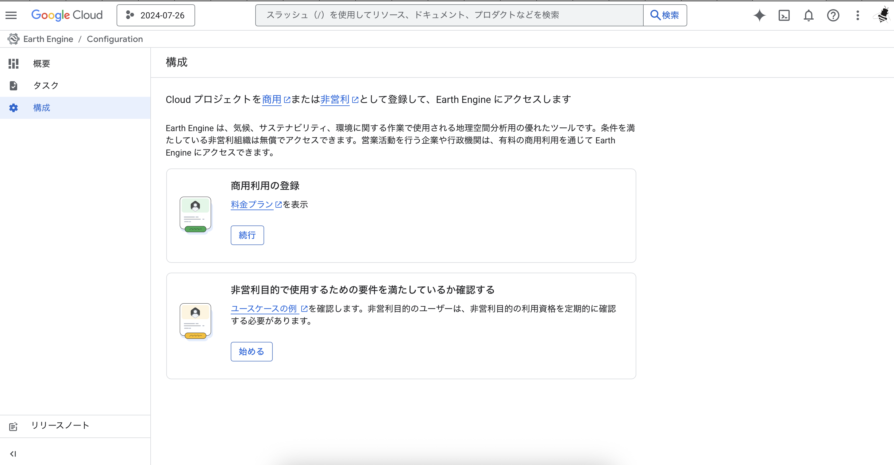
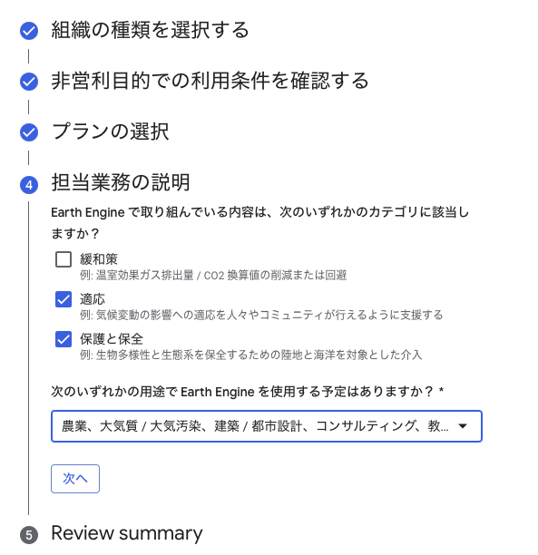
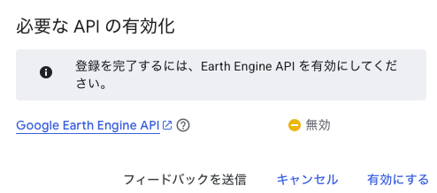
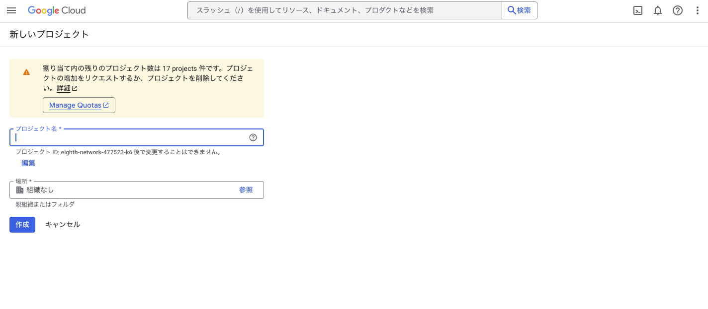
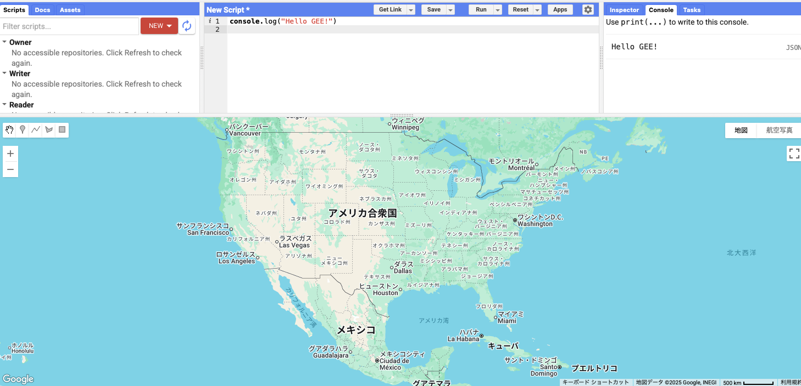
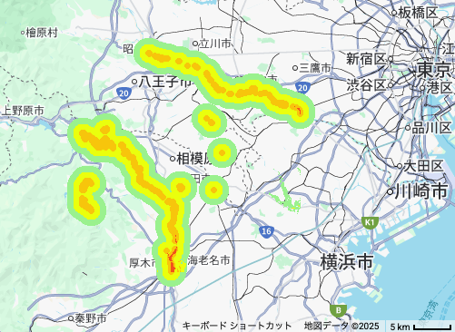

### 2025 青山学院大学特殊講義SI(1)
# リモセンｘDEM - Google Earth Engine を使ってDEMデータを利用してみよう！

担当 : 田中聡至 (フリーランスプログラマ / OSGeo JP 運営委員)


---


田中 : フリーランス技術者　/ OSGeoJP 運営委員
✉️ : alt9800jp@gmail.com


```md
# 最近やってること
LiDARや機械学習による測量支援 / 屋内の地図化ツール/
点字ブロック Lineデータ作成 /Web における3D
# お仕事
https://ikominaprj.xsrv.jp/AR/
# 趣味
https://simplespeedtest-amaranth.web.app
https://alt9800.github.io/visualization/prefecture-viewer/
# 登壇
iOSDC2024 : https://fortee.jp/iosdc-japan-2024/proposal/afbcd097-0da9-4073-8f48-528f007e28b7
# 最近つくってるもの
https://solemate-3xn.pages.dev
```

(ここもあとで編集するか)

---


知って欲しいこと : 3D地形データがどのように作られているか


(ツールの「使い方」の話に終始してしまいますが)

---


リモートセンシングとは？


---

Google Earth Engineとは？


---

Google Earthとの関連


---


GEEでできること


---

データカタログ

https://developers.google.com/earth-engine/datasets?hl=ja

90ペタバイトものデータがコレクションされている

衛星から得られたデータ(による画像データ)と解析済みのデータを分析・可視化したデータの両方を呼び出すことが可能。

---

衛星データの種類

---

## 光学衛星データ

|衛星名|解像度(観測波長)|周期|提供元|
|---|---|---|---|
|Landsat|30m(可視光・近赤外)、100m(熱赤外)|16日|USGS/NASA|
|Sentinel-2|10m, 20m, 60mなど(マルチスペクトル)|5日|ESA(欧州宇宙機関)|

いつのデータか、が重要

---

## SAR衛星データ

|衛星名|解像度(観測波長)|周期|提供元|
|---|---|---|---|
|Sentinel-1|10m|6-12日|ESA, EC|
|ALOS PALSAR|25m|5日|JAXA|


前者については「コペルニクス計画」とかで検索するとロマンが見えて面白いかも。


---


|データ名|解像度|解析手法|提供元|
|---|---|---|---|
|SRTM (Shuttle Radar Topography Mission)|90m (高解像度化済みデータもあり:30m)|レーダー干渉測量|USGS|
|NASA DEM|30m|ステレオ画像から生成|NASA|
|ALOS World 3D|30m|ALOS衛星のPALSAR(合成開口)レーダー干渉測量|JAXA|


---

と、このあたりの知識は詳しくは宙畑やRESTECさんによくまとまっているので参照されたし。

SARとは？？
https://sorabatake.jp/3364/

Sentinel-1とは？
https://www.restec.or.jp/satellite/sentinel-1-a-1-b


---

### コラム : 気象観測衛星「ひまわり」のデータを使いたい

JAXA ひまわりモニタ
https://www.eorc.jaxa.jp/ptree/index_j.html

ひまわりリアルタイムWeb - NICT
https://himawari8.nict.go.jp/

画像データ自体を入手したい場合は 
気象庁のJMA ArchiveからDLしてGEEに取り込むと、GEEのデータと組み合わせて可視化ができる。
(でもすでに多分コミュニティアセットとして有志がまとめてくれてるはず)

---

衛星の種類


---

航空写真測量とどう違うのさ


---


DEMとDSMについて

DEMが欲しいパターン : 地形図

DSMが欲しいパターン : 建物の高さ情報をしりたい時


---

https://earthengine.google.com

視覚的に見た方が理解しやすし人はYoutubeで視聴するのも面白いかも

---


まずはログイン


---


---


---





---


---


---





---




---


---


---


> いただいた回答からすると、非営利目的での Earth Engine の使用が可能です。

> 非営利団体登録の場合、お支払いプランは不要です。

> Earth Engine の構成ページで、1 日の使用量上限（EECU 時間）を作成、編集します。

---


EECU (Earth Engine Compute Unit) の割り当て


(ここら辺で請求書情報の割り当てが必要かも)

---

プロジェクトがない場合はまずは新しいプロジェクトをつくる



`earthengine-project-2025-11-07`みたいな名前にする


---

実際にコードエディターを触ってみましょう！

https://code.earthengine.google.com/




---

コードエディタとしてこのようにJavaScriptの文法が使える。

```js
console.log("Hello GEE!")

```


```js
var a=1
var b=2
var c=a+b
print(c)
```

---

<!--GEEの中でGeminiにトラブルシューティングさせてほしい-->

---

相模原市淵野辺５丁目付近のデータを見てみよう
`35.566958, 139.401946`

Google Mapsのデータとの比較もしてみる

---


随時「Reset」ボタンを押すといい感じ。

---

# 事例(ハンズオン)

---


# 青山学院大学周辺の浸水リスクを可視化してみよう！



---

## やること

Step1: 地形データを読み込んで可視化
Step2: 標高を小分けにして抽出(低地判断)
Step3: 水域データを読み込む
Step4: 水域からの距離を分析する
Step5: 水捌けの良さを分析する
Step6: リスクのスコア化
(Step7: 計算結果を数値で表示する)

---


Step1 地形データを読み込んで可視化してみよう！！

```js
// 対象地域の設定(相模原市周辺)
var center = ee.Geometry.Point([139.401946, 35.566958]);
var roi = center.buffer(15000).bounds();

// 地図の中心を設定
Map.centerObject(center, 11);

// DEMデータの読み込み
var dem = ee.ImageCollection('JAXA/ALOS/AW3D30/V3_2')
  .select('DSM')  // 地表面の標高を選択
  .mosaic()       // 複数タイルを結合
  .clip(roi);     // 対象地域で切り取り

// 標高を色分けして表示
Map.addLayer(dem, 
  {min: 0, max: 100, palette: ['blue', 'green', 'yellow', 'orange', 'red']}, 
  'Elevation (m)');

// 標高の最小値・最大値を確認
print('標高の統計:', dem.reduceRegion({
  reducer: ee.Reducer.minMax(),
  geometry: roi,
  scale: 30,
  maxPixels: 1e9
}));
```

---

Step2 標高を小分けにして抽出してみよう！(低地かどうかを判断したい！)

```js
// ステップ1のコードを実行した後に追加

// 標高5m未満のエリアを抽出
var lowLand5m = dem.lt(5).selfMask();

// 標高5m〜10mのエリアを抽出
var lowLand10m = dem.gte(5).and(dem.lt(10)).selfMask();

// 標高10m〜20mのエリアを抽出
var lowLand20m = dem.gte(10).and(dem.lt(20)).selfMask();

// 低地エリアを色分けして表示
Map.addLayer(lowLand20m, {palette: ['yellow']}, 'Elevation < 20m');
Map.addLayer(lowLand10m, {palette: ['orange']}, 'Elevation < 10m');
Map.addLayer(lowLand5m, {palette: ['red']}, 'Elevation < 5m');

// 標高5m未満の面積を計算
var area5m = lowLand5m.multiply(ee.Image.pixelArea()).reduceRegion({
  reducer: ee.Reducer.sum(),
  geometry: roi,
  scale: 30,
  maxPixels: 1e9
});

print('標高5m未満の面積 (km²):', ee.Number(area5m.get('DSM')).divide(1000000));
```


---

Step3 水域のデータを読み込んでみよう！

```js
// ステップ1-2のコードを実行した後に追加

// 水域データの読み込み(過去36年間の水の存在頻度)
var water = ee.Image('JRC/GSW1_4/GlobalSurfaceWater')
  .select('occurrence')
  .clip(roi);

// 50%以上の頻度で水が存在する場所を抽出(恒常的な河川・湖)
var permanentWater = water.gte(50).selfMask();

// 水域を青色で表示
Map.addLayer(permanentWater, {palette: ['blue']}, 'Rivers and Water Bodies');
```

JRC Global Surface Water: 人工衛星で観測した水域データ
これ自体もSAR衛星からのデータや光学データからの抽出がされているところがミソ。


---

Step4 水域からの距離分析を行う

```js

// ステップ3のコードを実行した後に追加

// 水域からの距離を計算(ピクセル単位)
var waterDistancePixels = permanentWater.fastDistanceTransform().sqrt();

// ピクセル単位をメートルに変換(1ピクセル=30m)
var waterDistance = waterDistancePixels.multiply(30);

// 距離を色分けして表示(近い=青、遠い=白)
Map.addLayer(waterDistance, 
  {min: 0, max: 1000, palette: ['darkblue', 'blue', 'lightblue', 'white']}, 
  'Distance from Water (m)');

// 河川から100m以内のエリアを抽出
var near100m = waterDistance.lt(100).selfMask();
Map.addLayer(near100m, {palette: ['purple']}, 'Within 100m from River');
```


---

Step5 水捌けの良さを定量的に示したい！
斜面の角度をDSM(DEM)データから分析してどれくらい水が流れやすそうか見積もる。

```js
// ステップ1のDEMデータを使用

// 傾斜角度を計算(度単位)
var slope = ee.Terrain.slope(dem);

// 傾斜を色分けして表示(平坦=緑、急=赤)
Map.addLayer(slope, 
  {min: 0, max: 30, palette: ['green', 'yellow', 'red']}, 
  'Slope (degrees)');

// 平坦地(傾斜3度未満)を抽出
var flatArea = slope.lt(3).selfMask();
Map.addLayer(flatArea, {palette: ['cyan']}, 'Flat Areas (slope < 3°)');

// 平坦地の統計
print('傾斜の統計:', slope.reduceRegion({
  reducer: ee.Reducer.minMax(),
  geometry: roi,
  scale: 30,
  maxPixels: 1e9
}));
```


---

Step 6-1 評価のためのスコアリング : 標高の低さによるリスク

```js

// ステップ1-5のコードを実行した後に追加

// 【要因1】標高リスク(0-3点)
var elevationRisk = ee.Image(0)
  .where(dem.lt(5), 3)              // 5m未満: 3点
  .where(dem.gte(5).and(dem.lt(10)), 2)   // 5-10m: 2点
  .where(dem.gte(10).and(dem.lt(20)), 1); // 10-20m: 1点

// 標高リスクを表示
Map.addLayer(elevationRisk.updateMask(elevationRisk.gt(0)), 
  {min: 1, max: 3, palette: ['yellow', 'orange', 'red']}, 
  'Elevation Risk');

print('標高リスクの分布を確認してください');
```

---

Step 6-2 評価のためのスコアリング : 河川からの距離によるリスク

```js

// 【要因2】河川距離リスク(0-3点)
var distanceRisk = ee.Image(0)
  .where(waterDistance.lt(100), 3)           // 100m未満: 3点
  .where(waterDistance.gte(100).and(waterDistance.lt(300)), 2)  // 100-300m: 2点
  .where(waterDistance.gte(300).and(waterDistance.lt(500)), 1); // 300-500m: 1点

// 河川距離リスクを表示
Map.addLayer(distanceRisk.updateMask(distanceRisk.gt(0)), 
  {min: 1, max: 3, palette: ['lightblue', 'blue', 'darkblue']}, 
  'Distance Risk');

print('河川距離リスクの分布を確認してください');
```


---

Step 6-3 評価のためのスコアリング : 平坦地であることのリスク

```js
// 【要因3】傾斜リスク(0-1点)
var slopeRisk = ee.Image(0).where(slope.lt(3), 1);

// 傾斜リスクを表示
Map.addLayer(slopeRisk.updateMask(slopeRisk.gt(0)), 
  {palette: ['purple']}, 
  'Slope Risk (Flat Areas)');

print('平坦地(水が溜まりやすいエリア)を確認してください');
```


---

Step 6-4 リスク計算(スコアリング)

```js

// 3つのリスクを合計(最大7点)
var totalRisk = elevationRisk.add(distanceRisk).add(slopeRisk);

// 総合リスクを可視化
Map.addLayer(totalRisk.updateMask(totalRisk.gt(0)), 
  {min: 1, max: 7, palette: ['lightgreen', 'yellow', 'orange', 'red', 'darkred', 'purple']}, 
  'Total Flood Risk');

// リスクレベルの説明
print('==========================================');
print('総合リスク評価:');
print('1-2点: 低リスク (light green - yellow)');
print('3-4点: 中リスク (orange)');
print('5-7点: 高リスク (red - purple)');
print('==========================================');
```

---

Step 7 コンソールに計算結果を表示させる

```js

// ステップ6までのコードを実行した後に追加

// リスクレベルごとの面積を計算
var riskLevels = [1, 2, 3, 4, 5, 6, 7];

riskLevels.forEach(function(level) {
  var riskArea = totalRisk.eq(level).multiply(ee.Image.pixelArea());
  var area = riskArea.reduceRegion({
    reducer: ee.Reducer.sum(),
    geometry: roi,
    scale: 30,
    maxPixels: 1e9
  });
  
  print('リスクレベル ' + level + ' の面積 (km²):', 
        ee.Number(area.get('constant')).divide(1000000));
});
```


---


Extra : 画像として出力したい

```js

// ========================================
// 追加: エクスポート用の設定(オプション)
// ========================================

// 結果を画像としてエクスポート
Export.image.toDrive({
  image: totalRisk.visualize({min: 1, max: 7, palette: ['lightgreen', 'yellow', 'orange', 'red', 'darkred', 'purple']}),
  description: 'FloodRisk_Fujisawa_Tamagawa',
  scale: 30,
  region: roi,
  maxPixels: 1e9
});
```
先にGoogle Driveを保存先に指定する必要がある。


---

## 能登半島地震(2024年1月1日)前後で起きた地滑りを見てみよう

[ポイント]
DEMデータが存在しないような場所ではどのような解析ができるか？
人工衛星から得られたデータをどのように解析するか？

(こちらは講義時間の進み方次第で取り扱います。)


---

GEEではSARのデータを使った地表面の変化を確認することができ、この値の違いを時期ごとに比較することにより、表面の様子の差分を抽出することができます。

```
地滑り前 = 植生がある → SAR反射が強く取得できる
地滑り後 = 裸地になる → SAR反射が弱くなる
```
というような原理。


---


(ちなみに、InSARのデータを用いると位相差を確認できるので、どれくらい地面が隆起したかなどを確認することもできます。だいち二号のお仕事 : https://www.gsi.go.jp/uchusokuchi/20240101noto_insar.html)

---

県道26号線周辺の地滑りの様子がスタジオダックビルさんと東京大学の渡邉研究室によってCesium Ionをつかってストーリーテリングにされています。
https://ion.cesium.com/stories/viewer/?id=a4bbf02c-dd2e-4a16-9556-6543ace0b96d#slide-id-186298

鵜飼漁港の位置
https://maps.app.goo.gl/d7GQ2M7PbVZfSPnR9
https://www.openstreetmap.org/#map=17/37.401226/137.242917

---


---


Google Earth Engineで扱う画像のライセンス


---


類似サービス


VEGA

Tellus

EQ


---


https://x.com/emmyeil/status/1986632418682667373

なんか本が出るらしいぞ

---


もっと3Dで見てみたい！！

3D TilesやRGB Terrainのような形式にしてみよう！


---